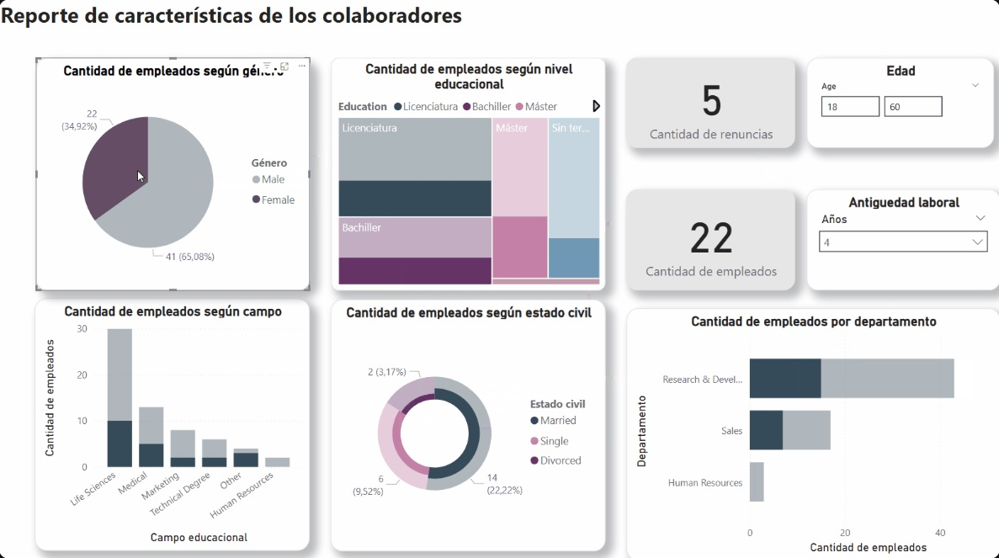

# 📊 Dashboard de Características de Empleados – Análisis de Datos de RRHH

## 📌 Descripción del Proyecto

Este proyecto presenta un dashboard interactivo desarrollado a partir de un conjunto de datos interno del área de Recursos Humanos. El objetivo principal es analizar la composición de la fuerza laboral, identificar tendencias relevantes y generar información útil para apoyar la toma de decisiones estratégicas dentro de la organización.

El análisis se basa en variables demográficas, educativas y laborales de los empleados.

---

## 🎯 Objetivos

- Analizar la composición demográfica de los empleados
- Evaluar la distribución del nivel educativo
- Identificar patrones relacionados con las renuncias
- Examinar la distribución de empleados por departamento
- Permitir una exploración interactiva mediante filtros dinámicos

---

## 📂 Descripción del Dataset

El conjunto de datos incluye las siguientes variables principales:

- Género
- Edad
- Estado civil
- Nivel educativo
- Campo de estudio
- Departamento
- Antigüedad
- Número de renuncias

Antes del diseño del dashboard, se realizó un proceso de:

- Exploración de datos (EDA)
- Limpieza y tratamiento de valores faltantes
- Estandarización de categorías
- Validación de consistencia

---

## 📊 Componentes del Dashboard

- **Distribución por género:** Gráfico circular que muestra el equilibrio de género.
- **Nivel educativo:** Treemap que representa los niveles académicos predominantes.
- **Indicadores clave (KPIs):** Tarjetas con el total de empleados y total de renuncias registradas.
- **Campo de estudio:** Gráfico de barras que clasifica a los empleados según su formación académica.
- **Estado civil:** Gráfico de dona que ilustra la composición sociodemográfica.
- **Empleados por departamento:** Gráfico de barras horizontal que muestra la distribución del personal.
- **Filtros interactivos:** Segmentación por edad y antigüedad para análisis más detallado.

---

## 🛠 Herramientas Utilizadas

- Herramienta de visualización (Power BI)
- Procesamiento y limpieza de datos
- Análisis exploratorio de datos (EDA)

---

## 📈 Resultados e Insights

El análisis permitió:

- Comprender la estructura demográfica de la organización
- Detectar niveles educativos predominantes
- Identificar departamentos con mayor concentración de empleados
- Analizar tendencias relacionadas con las renuncias

---

## 👤 Autor

Gladys Ramos

Analista de Datos | Business Intelligence
